# Drupal Website on Azure Web App for Linux Using Containers

Drupal workloads can already be deployed on regular Azure Web App for Windows. The problem with that solution is that this technology is built for Linux first and Windows is mostly an afterthought which means that Linux is really where developers receive the best experience. Also, developers using these technologies are generally more familiar with the Linux environment so there is little incentive for them to learn a second platform where support and performance is less interesting.

Things have now changed because it is now possible to deploy Linux workloads on Azure Web Apps by leveraging Docker containers. This document will explain how we can achieve a CI/CD pipeline with VSTS and Azure Web Apps for Linux using Docker containers to deploy Drupal workloads.

At a high level this is what we will do:

1. Setup Visual Studio Team Services
2. Setup your source control
3. Setup your Azure environment
4. Setup and define the build steps
5. Setup and define the release steps

We will expand on these points one by one. This diagram gives a high level overview of what we will achieve.

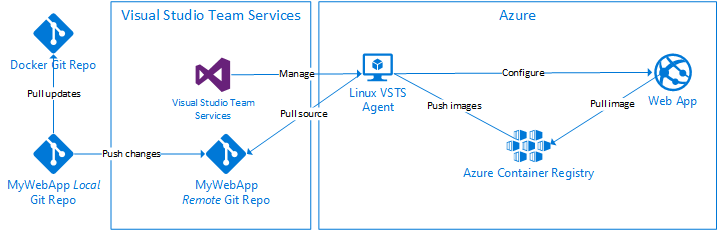

# Setup Visual Studio Team Services

This steps it meant to define the build and deployment services that will be leveraged in this solution.

1.	Create your account if you don’t already have one. You can do so [here](https://www.visualstudio.com/team-services/).
2.	Create a VSTS project for your Drupal Website

    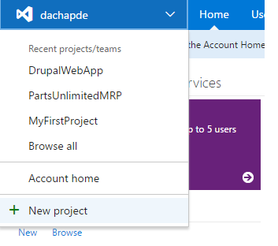

3. Install Docker extensions for VSTS [here](https:/marketplace.visualstudio.com/items?itemName=ms-vscs-rm.docker).
4. Setup a Linux build agent for VSTS.
    1. Deploy a Ubuntu Server 16.04 VM on Azure [here](https://portal.azure.com/). A D1 with a SSD drive would be plenty.
    2. Install the VSTS agent as explained [here](https://www.visualstudio.com/en-us/docs/build/admin/agents/v2-linux). Make sure you configure it to run as a service that starts on boot.
        * If you get this error “Failed to initialize CoreCLR, HRESULT: 0x80131500” when configuring the agent then you need to install a specific version of libicu.
            ```
            wget http://security.ubuntu.com/ubuntu/pool/main/i/icu/libicu52_52.1-3ubuntu0.4_amd64.deb
            sudo dpkg -i libicu52_52.1-3ubuntu0.4_amd64.deb
            ```
    3. Install PHP: 
    ```
    sudo apt-get install php libapache2-mod-php php-mcrypt php-MySQL
    ```
    4. Install Composer as explained [here](https://getcomposer.org/download/) and then run this:
    ```
    mv composer.phar /usr/local/bin/composer
    ```
    5. Install Docker as explained [here](https://docs.docker.com/engine/installation/linux/ubuntu/)
        * 	Once done, follow [this](https://docs.docker.com/engine/installation/linux/linux-postinstall/) to allow access for non-root users and to enable the docker service to start on boot.
    6. Install Azure-CLI as explained [here](https://docs.microsoft.com/en-us/azure/xplat-cli-install)
    7. Reboot the agent, it should show up as online in VSTS afterwards.

# Setup your source control

The next step is to have Drupal’s source code along with your own in a Git repository that you own. We will assume that this code will be hosted in VSTS. This setup will allow you to easily pull changes from upstream and control when these changes are pulled. This follows guidelines explained by the Drupal project [here](https://www.drupal.org/node/803746).

1. Clone the Drupal branch that you are interested in developing against.
    ```
    git clone --branch 7.x https://git.drupal.org/project/drupal.git {mywebapp}
    cd {mywebapp}
    ```
2. Add VSTS as a remote origin and push to it.
    ```
    git remote rename origin drupal
    git remote add origin https://{my}.visualstudio.com/_git/{mywebapp}
    git push -u origin –all
    ```
3. Copy the deployment folder from this procedure to your repository and push them to your repository.
    ```
    copy {source}\deployment {mywebapp}\
    ```
4. Copy the settings.php file at its usual destination in your Drupal website. It is preconfigured to fetch its database settings from environment variables
    ```
    mkdir {mywebapp}\sites\default
    copy {source}\settings.php {mywebapp}\sites\default
    ```
5. Let's commit theses changes and push them to our remote server
    ```
    git add .
    git commit -m “Adding build, deployment scripts and preconfigured settings.php”
    git push
    ```

# Setup your Azure environment

This step will have you deploy a Web App on Linux which will be used to deploy your web app and also a Azure Container Registry which will host your Docker containers.

1.	Deploy a Web App on Linux with default settings. You can find it [here](https://ms.portal.azure.com/#create/Microsoft.AppSvcLinux)
2.	Deploy an Azure Container Registry which you can find [here](https://ms.portal.azure.com/#create/Microsoft.ContainerRegistry)

# Setup and Define the Build Steps

In this step, we will go through the VSTS tasks and required scripts to generate the build artifacts. This include the Docker container itself.

1. Create an empty build definition by visiting: <https://{my}.visualstudio.com/{mywebapp}/_build>
2. Make sure to select “Continuous integration” and to select the agent pool where you set up your Linux agent in the previous steps.

    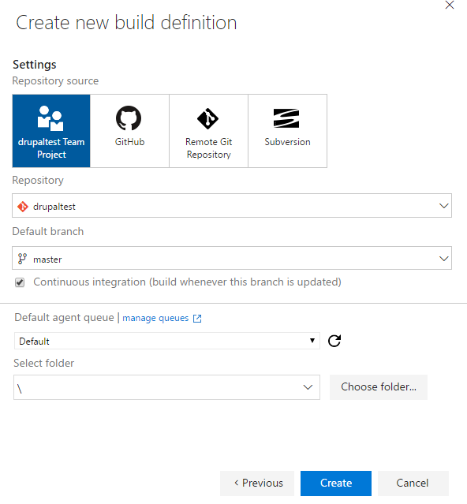

3. Add a Shell Script step and configure it to run the build.sh script as seen here. This script essentially takes care of cleaning up the work folder and resolving PHP dependencies with Composer if needed.

    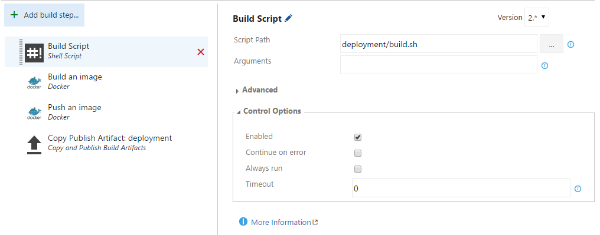

4.	Add a “Docker” tasks which is part of the Docker extension for VSTS as seen here. You will need to setup the Docker Registry Connection by selecting the “Add” link and filling the connection information to your Azure Container Registry that was deployed previously. This build step takes the DockerFile and builds a Docker image with it. The DockerFile is based on the one published by the Drupal project on DockerHub. It also includes Drush which is a command line tool to manage Drupal websites.

    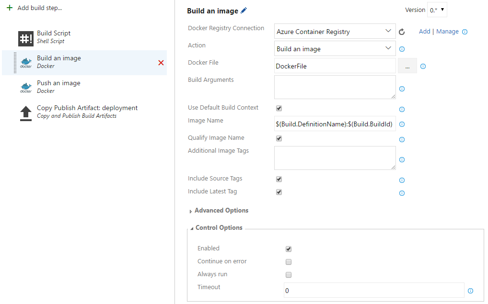

5. Add a “Push an Image” tasks as seen here. This pushes the previously build Docker image to a centralized location.

    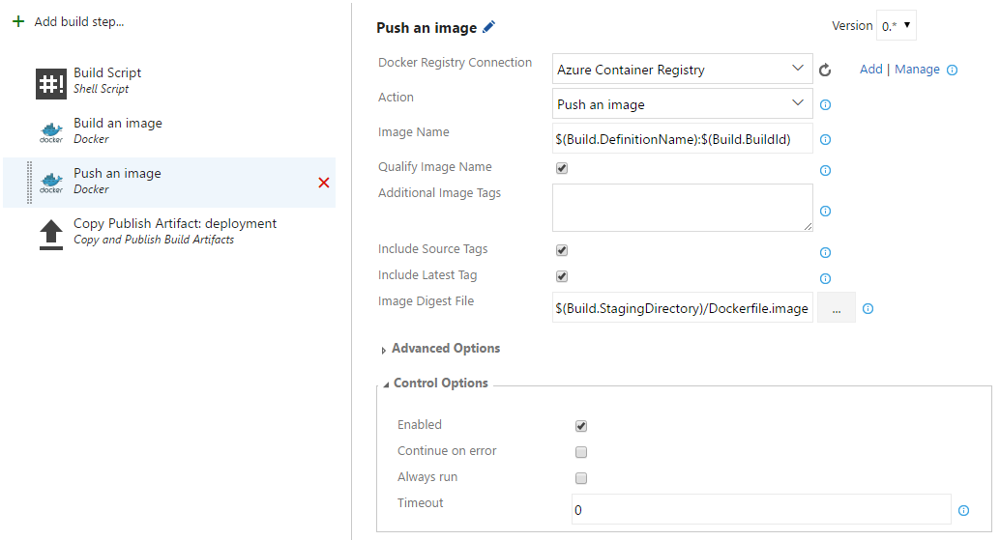

6. Add a “Copy Publish Artifact” to publish the content of the deployment folder as an artifact on VSTS. This will be reused in the release steps.

    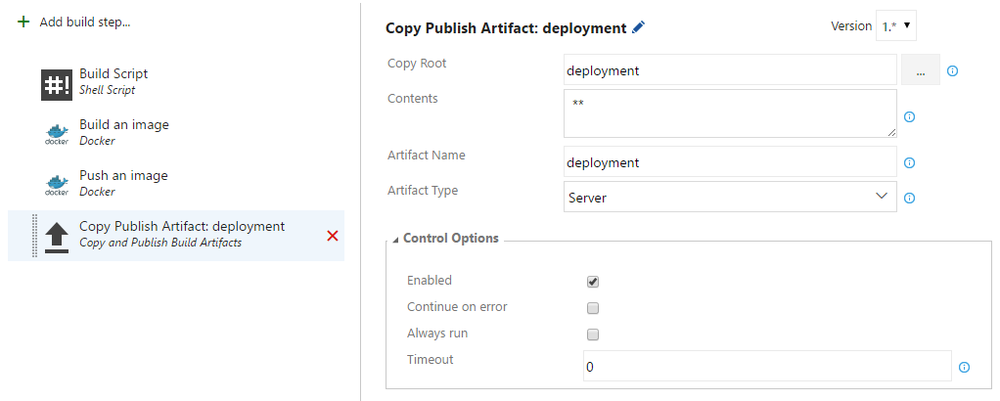

7. Test your new build by triggering a manual build or by pushing a meaningless change to your git repo. 

# Setup and define the release steps

In this step, we will go through the steps required to deploy the Docker container to Azure Web App on Linux. 

1. First, create your empty release definition here: <https://{my}.visualstudio.com/{mywebapp}/_apps/hub/ms.vss-releaseManagement-web.hub-explorer>
2. Make sure to select “Continuous deployment”, to select the right source and the right agent queue.

    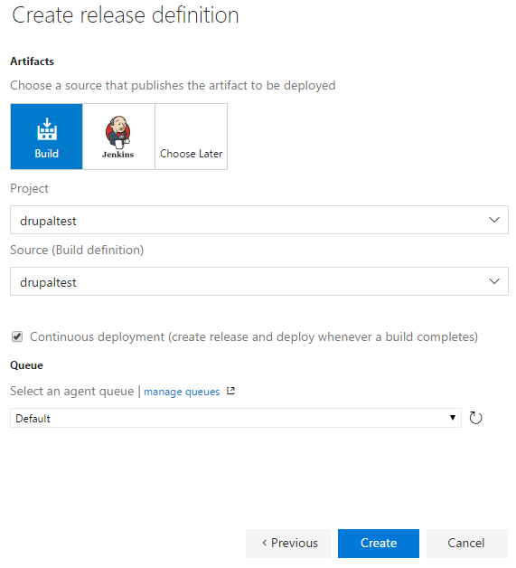

3. Rename the environment “Environment 1” to “dev”
4. Click the … on the “dev” environment to configure the variables and configure them as shown here. Replace the Docker registry variables with appropriate values for your Azure Container Registry. Replace the DB******* variables with appropriates values to point to your MySQL database.

    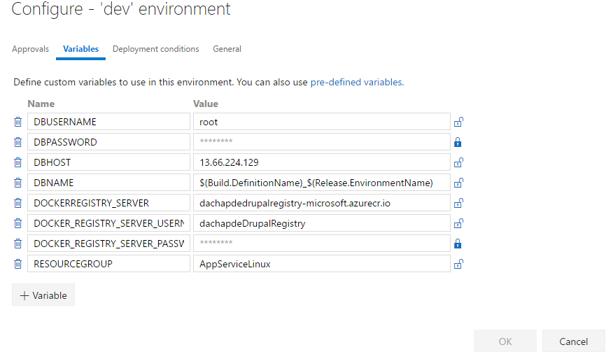

5. Add an “Azure CLI Preview” task and configure it as shown. This step executes the script release.sh which takes care of configuring the Web App and update its settings so that it now points to the updated Docker container. The Web App will automatically pull the new container after that.

    

6. Add a Docker VSTS task and configure it as shown. This sill start a container for the given Docker image within the build agent and allow us to interact with it.

    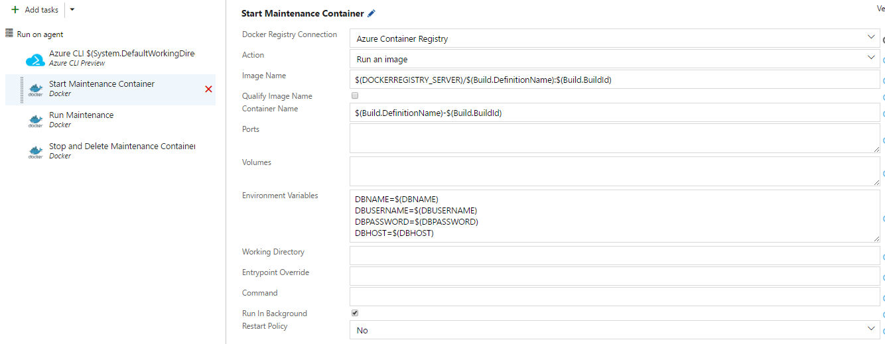

7. Add a Docker VSTS task and configure it as shown. This will run the maintenance.sh script within the container and thus allow us to run migration scripts on the database. This script takes care of disabling the website, clearing the cache, migrating the website and then restoring it. This is part of a standard upgrade process for Drupal websites.

    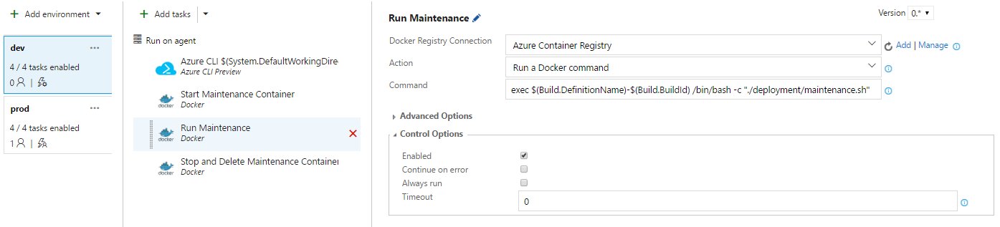

8. Add a Docker VSTS task and configure it as shown. This will delete the container that was used for the maintenance. Its important to select the “Always run” option so that the container is properly cleaned up even in the case of a failed deployment.

    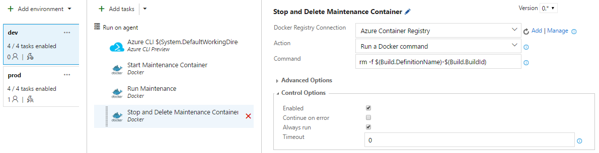

9. Create a new environment “prod” from the “dev” environment and configure it as shown. Update the variables of this environment to match your prod environment. Make sure to disable automatic deployment for this prod environment.

    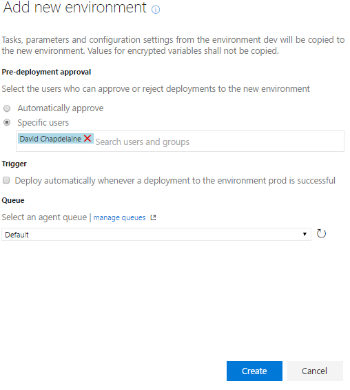

# Wrap Up

You should now have a build that upon commit will launch a build which will build a Docker container and push it to a centralized location. After this build succeeds, the release pipeline kicks in and automatically deploys that container to your Web App and also runs the migration script which takes care of Drupal migrations using Drush. Once ready, you can deploy to your prod environment by manually triggering the deployment.
